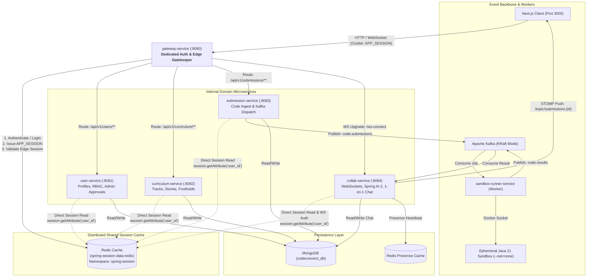

# Architecture Spine — CodeConnect

## 1. Design Paradigm

CodeConnect adheres to an **Event-Driven Microservices Architecture with Edge Gateway & Reactive WebSockets**, implemented within a **Modular Monorepo**:

* **Edge Gateway Layer**: Dedicated `gateway-service` acting as the sole public reverse proxy and authentication gatekeeper.
* **Domain Services Layer**: Independent, decoupled Spring Boot microservices handling core domains (Users/Auth, Curriculum/Progress, Submission Ingest, Collaboration/AI).
* **Asynchronous Execution Pipeline**: Event-driven decoupling via **Apache Kafka** where heavy, untrusted Java code execution is handled asynchronously by isolated worker pods.
* **Real-Time Push Layer**: **STOMP over WebSocket** streaming test execution results and 1-on-1 chat directly into the Next.js client.



---

## 2. Invariants & Rules

### AD-1 [ADOPTED] — Repository Topology & Standalone Service Build Invariant
* **Binds:** All codebase components.
* **Prevents:** Root Maven reactor build cascading failures, unnecessary inter-service compile coupling, and polyrepo CI/CD friction.
* **Rule:** All backend services, the frontend application, and deployment charts must reside within a single **Modular Monorepo** (`codeconnect/`). Each microservice is an independently configured, self-contained Spring Boot application with its own **standalone `pom.xml`** (`services/<service-name>/pom.xml`) inheriting directly from `spring-boot-starter-parent`. There is no root Maven parent POM; each service builds and containerizes autonomously.

### AD-2 [ADOPTED] — Dedicated Gateway Auth & Shared Spring Session Redis Invariant
* **Binds:** `gateway-service`, `user-service`, `curriculum-service`, `submission-service`, `collab-service`, Next.js client.
* **Prevents:** Client-side JWT theft via XSS, token tampering, JWT signing key desynchronization across services, and stale authorization states.
* **Rule:** 
  1. **Zero Client JWT Exposure:** The browser must **never** receive, store, or transmit a JWT. All authentication state relies strictly on an opaque `APP_SESSION` cookie marked `HttpOnly`, `Secure`, and `SameSite=Strict`.
  2. **Dedicated Auth Gateway:** `gateway-service` serves as the dedicated authentication entry point handling credential-based auth: `POST /api/v1/auth/login`, `POST /api/v1/auth/signup`, `POST /api/v1/auth/logout`, `GET /api/v1/auth/me`. Credentials (email/password) are verified with BCrypt against the MongoDB `users` collection. Upon verification, `gateway-service` creates the reactive session in Redis and issues the `APP_SESSION` cookie.
  3. **Shared Distributed Session Cache:** `gateway-service` and all internal domain services (`curriculum-service`, `submission-service`, `collab-service`, `user-service`) share the exact same `spring-session-data-redis` cache instance and namespace (`spring:session`).
  4. **Direct Microservice Session Access:** When `gateway-service` routes requests downstream, it forwards the incoming `Cookie: APP_SESSION=...`. Each downstream service uses Spring Session's session repository filter to resolve user identity (`session.getAttribute("user_id")`, `session.getAttribute("role")`) directly from Redis. In addition, Gateway injects trusted internal headers (`X-User-Id`, `X-User-Role`) as a lightweight optimization.
  5. **Instant Global Invalidation:** Invoking `/api/v1/auth/logout` or an admin revoking an active session deletes the session key from Redis (`DEL spring:session:sessions:<id>`). This instantly revokes access across Gateway and ALL downstream microservices simultaneously in O(1) time without token-expiry lag.

### AD-3 [ADOPTED] — Asynchronous Code Execution via Kafka & STOMP
* **Binds:** `submission-service`, `sandbox-runner-service`, `collab-service`, and Next.js frontend.
* **Prevents:** HTTP connection pool starvation and timeout crashes during high concurrent submission bursts.
* **Rule:** Code submission must never execute synchronously over HTTP. The `submission-service` must immediately return `HTTP 202 Accepted { submissionId }` upon publishing the job to Kafka topic `code.submissions`. Evaluation results must be published to Kafka topic `code.results` and delivered to the client via STOMP over WebSocket to `/topic/submissions.{submissionId}`.

### AD-4 [ADOPTED] — Untrusted Code Sandbox Isolation
* **Binds:** `sandbox-runner-service`.
* **Prevents:** Host system compromise, remote code execution (RCE), network attacks, and host resource exhaustion.
* **Rule:** Student code must execute strictly inside an ephemeral, locked-down execution container with:
  1. `--network none` (zero outbound/inbound network).
  2. `--memory 128m` (strict OOM kill boundary).
  3. `--cpus 1.0` and a hard process timeout of 3000ms.
  4. Ephemeral in-memory `tmpfs` volume mounted read-only after file write. The container must be destroyed immediately upon completion (`--rm`).

### AD-5 [ADOPTED] — Unified Document Persistence
* **Binds:** `user-service`, `curriculum-service`, `submission-service`, `collab-service`.
* **Prevents:** Complex polyglot database drift and multiple conflicting migration workflows in MVP.
* **Rule:** **MongoDB** is the sole persistent document database for all business domain collections (`users`, `mentor_approval_requests`, `tracks`, `footholds`, `user_progress`, `chat_messages`, `escalation_tickets`). Redis is reserved strictly for ephemeral session storage (`spring-session-data-redis`) and presence caching (`presence:{userId}`).

### AD-6 [ADOPTED] — Socratic AI Narrative Anchoring
* **Binds:** `collab-service` (Spring AI module).
* **Prevents:** The AI tutor giving away direct code solutions or dumping cold compiler jargon.
* **Rule:** The Socratic AI service must assemble prompts using **Spring AI 2.x.x** that inject the active Foothold's real-world story analogy. The system prompt strictly prohibits emitting functional code blocks or full answers, and enforces conversational adaptation in English or Hinglish based on student phrasing.

### AD-7 [ADOPTED] — Presence & Peer Solver Discovery
* **Binds:** `collab-service` and Next.js frontend.
* **Prevents:** Slow database scanning to calculate user presence.
* **Rule:** Active clients must emit a WebSocket heartbeat every 30 seconds, maintaining a Redis key `presence:{userId}` with a 60-second TTL. The peer solver list is derived by intersecting MongoDB `foothold_completions` with Redis presence keys, allowing students to message both online and offline solvers.

### AD-8 [ADOPTED] — Portable Local Infrastructure & Orchestration
* **Binds:** Infrastructure, local development, and deployment pipelines.
* **Prevents:** Local development environment drift across developer machines and heavy virtualization lock-in.
* **Rule:** The system must support two complementary, zero-drift local workflows:
  1. **Fast-Dev Infrastructure Stack (Docker Compose):** A dedicated `infra/docker-compose.infra.yml` spins up the stateful backing services (**MongoDB 7.0**, **Redis 7.2**, **Apache Kafka in KRaft mode**) on any local OS or remote VM with a single command (`docker compose -f infra/docker-compose.infra.yml up -d`). Developers can run Spring Boot services directly via Maven (`./mvnw spring-boot:run`) with instant debugger and hot-reload support.
  2. **Production-Parity Cluster (k3d + Helm):** Complete cluster orchestration inside local **k3d / k3s** using unified Helm charts. All Spring Boot JVMs are constrained to `-Xmx256m` with G1GC, staying within a lean **~2.8 GB total cluster RAM** footprint on 16 GB Apple Silicon.

### AD-9 [ADOPTED] — Role-Based Access Control (RBAC) & User Management Lifecycle
* **Binds:** `gateway-service`, `user-service`, all downstream services, and Next.js frontend middleware.
* **Prevents:** Privilege escalation, unverified mentors accessing student escalation channels, inconsistent role enforcement across microservices, and stale authorization states upon role promotion or account ban.
* **Rule:** 
  1. **Strict Tri-Role Hierarchy:** The platform enforces three canonical roles: `ROLE_STUDENT`, `ROLE_MENTOR`, and `ROLE_ADMIN`.
  2. **Mentor Onboarding & Approval Lifecycle (FR-15):** 
     - Students activate instantly upon signup (`status: ACTIVE`).
     - Mentors register with credentials and professional proof (LinkedIn URL, bio), landing in `status: PENDING_APPROVAL` with an audit record in MongoDB collection `mentor_approval_requests`.
     - Mentors cannot access the Tier 3 Escalation Queue, view student submissions, or claim tickets until an Admin explicitly invokes `POST /api/v1/admin/mentors/{id}/approve`.
  3. **Dual-Layer RBAC Enforcement:**
     - *Edge Gateway Layer:* `gateway-service` validates URL path prefixes (e.g., `/api/v1/admin/**` requires `ROLE_ADMIN`; `/api/v1/mentor/**` requires `ROLE_MENTOR`) before forwarding traffic.
     - *Domain Service Layer:* Microservice controllers and service methods enforce declarative authorization via Spring Security annotations (`@PreAuthorize("hasRole('ADMIN')")`, `@PreAuthorize("hasAnyRole('STUDENT', 'MENTOR')")`), backed by authorities resolved from the shared `spring-session-data-redis` context.
  4. **Immediate Distributed Role Elevation & Revocation:** When an Admin approves a Mentor or bans a user (`status: BANNED`), `user-service` updates MongoDB and immediately updates or evicts the user's active session in Redis via `FindByIndexNameSessionRepository`. The user's role elevation or revocation takes effect instantaneously across all microservices in $O(1)$ time without token expiration lag.
  5. **Client Route Guards:** Next.js Edge Middleware (`middleware.ts`) inspects the user role via `/api/v1/auth/me`, blocking unauthorized access to `/admin/**` and `/mentor/**` client routes before components mount.

---

## 3. Consistency Conventions

### 3.1 RBAC Permission Matrix

| Resource / Action | Endpoint Pattern | Student | Mentor (Approved) | Admin |
|---|---|:---:|:---:|:---:|
| **Foothold & Story Access** | `GET /api/v1/curriculum/footholds/{id}` | ✅ | ✅ | ✅ |
| **Code Submission** | `POST /api/v1/submissions` | ✅ | ✅ | ✅ |
| **Socratic AI Hints (Tier 1)** | `POST /api/v1/collab/ai/hints` | ✅ | ✅ | ✅ |
| **Peer 1-on-1 Chat (Tier 2)** | `STOMP /topic/chat.{threadId}` | ✅ | ✅ | ✅ |
| **Escalate Ticket (Tier 3)** | `POST /api/v1/collab/tickets` | ✅ | ❌ | ❌ |
| **Claim / Resolve Ticket** | `POST /api/v1/collab/tickets/{id}/claim` | ❌ | ✅ | ✅ |
| **View Student Code Diff** | `GET /api/v1/collab/tickets/{id}/code` | ❌ | ✅ | ✅ |
| **Pending Mentor Queue** | `GET /api/v1/admin/mentors/pending` | ❌ | ❌ | ✅ |
| **Approve / Reject Mentor** | `POST /api/v1/admin/mentors/{id}/approve` | ❌ | ❌ | ✅ |
| **User Ban / Session Evict** | `POST /api/v1/admin/users/{id}/ban` | ❌ | ❌ | ✅ |
| **Track & Foothold Authoring**| `POST /api/v1/admin/curriculum/tracks` | ❌ | ❌ | ✅ |

| Concern | Convention |
|---|---|
| **API Endpoints** | RESTful nouns, pluralized: `/api/v1/curriculum/footholds/{id}`, `/api/v1/submissions`. |
| **Auth Endpoints** | `/api/v1/auth/login`, `/api/v1/auth/signup`, `/api/v1/auth/logout`, `/api/v1/auth/me`. |
| **Internal Headers** | `X-User-Id` (MongoDB ObjectId string), `X-User-Role` (`STUDENT`, `MENTOR`, `ADMIN`). |
| **Kafka Topics** | Dot-separated event topics: `code.submissions`, `code.results`, `chat.events`, `admin.notifications`. |
| **STOMP Destinations** | `/topic/submissions.{id}`, `/topic/chat.{threadId}`, `/queue/presence`. |
| **Build System** | Standalone Apache Maven per Service (`services/<service>/pom.xml`). |
| **Error Format** | RFC 7807 Problem Details: `{ "type", "title", "status", "detail", "instance", "timestamp" }`. |
| **Dates & Times** | ISO 8601 UTC strings (`2026-09-23T13:30:00Z`). |

---

## 4. Stack & Verified Versions

| Component | Technology | Verified Version | Purpose |
|---|---|---|---|
| **Build Tool** | Apache Maven (Standalone per service) | `3.9.x` | Independent dependency & packaging management per microservice |
| **Frontend** | Next.js (App Router) | `14.2.x` / `15.x` | Responsive Web Application Cockpit |
| **Code Editor** | Monaco Editor (`@monaco-editor/react`) | `4.6.x` | In-browser Java coding interface |
| **WebSocket Client** | `@stomp/stompjs` + `sockjs-client` | `7.0.x` | Real-time STOMP messaging & test push |
| **Language Runtime** | Java LTS | `21` | Enterprise LTS runtime for all backend services |
| **Backend Framework** | Spring Boot | `3.3.x` | Microservices application framework |
| **API Gateway** | Spring Cloud Gateway | `4.1.x` | Edge routing, CORS, and session verification |
| **Session Store** | Spring Session Data Redis | `3.3.x` | Stateful server-side session management |
| **AI Integration** | Spring AI | `2.x.x` | OpenAI client abstraction and streaming (Latest 2.x) |
| **LLM Provider** | OpenAI API (`gpt-4o-mini`) | `v1` | Fast, cost-effective Socratic tutor inference |
| **Message Broker** | Apache Kafka (KRaft mode) | `3.7.x` | Asynchronous event streaming (No Zookeeper) |
| **Primary Database** | MongoDB Community Server | `7.0.x` | Unified document persistence |
| **In-Memory Cache** | Redis | `7.2.x` | Sessions, presence heartbeats, solver sets |
| **Local Infrastructure** | Docker Compose | `2.x` | Standalone MongoDB, Redis, and Kafka stack |
| **Local Orchestration** | k3d (K3s in Docker) + Helm | Helm `3.15.x` | Local Kubernetes deployment with cloud parity |

---

## 5. Structural Seed (Repository Layout)

```
codeconnect/
├── infra/                              # Standalone Stateful Infrastructure Stack
│   ├── docker-compose.infra.yml        # MongoDB 7.0, Redis 7.2, Kafka (KRaft)
│   └── mongo-init/                     # Mongo initial collections & indexes
│
├── helm/                               # Unified Kubernetes Helm Charts
│   ├── Chart.yaml
│   ├── values.yaml
│   └── templates/
│       ├── gateway-deployment.yaml
│       ├── user-service-deployment.yaml
│       ├── curriculum-service-deployment.yaml
│       ├── submission-service-deployment.yaml
│       ├── sandbox-runner-deployment.yaml
│       ├── collab-service-deployment.yaml
│       └── ingress.yaml
│
├── frontend/                           # Next.js 14/15 App Router
│   ├── src/
│   │   ├── app/                        # Pages: /login, /dashboard, /track/[id]
│   │   ├── components/                 # Cockpit (50/50), Editor, Drawer
│   │   └── lib/                        # STOMP client, API fetchers
│   └── package.json
│
├── services/
│   ├── gateway-service/                # Dedicated Ingress, Auth (Port 8080)
│   │   └── pom.xml                     # Standalone Spring Boot POM
│   ├── user-service/                   # User Profiles, RBAC, Admin Approvals (Port 8081)
│   │   └── pom.xml                     # Standalone Spring Boot POM
│   ├── curriculum-service/             # Tracks, Stories, Footholds (Port 8082)
│   │   └── pom.xml                     # Standalone Spring Boot POM
│   ├── submission-service/             # Submission Ingest & Kafka Dispatch (Port 8083)
│   │   └── pom.xml                     # Standalone Spring Boot POM
│   ├── sandbox-runner-service/         # Worker: Isolated Java 21 Sandbox
│   │   └── pom.xml                     # Standalone Spring Boot POM
│   └── collab-service/                 # WebSockets, Spring AI 2.x.x, Chat (Port 8084)
│       └── pom.xml                     # Standalone Spring Boot POM
│
└── README.md
```

---

## 6. Deferred Decisions

* **Cloud Provider Infrastructure**: AWS EKS vs GCP GKE vs DigitalOcean Kubernetes is deferred to the production deployment sprint.
* **LLM Model Fallback Provider**: Multi-provider fallback (e.g. Anthropic Claude / Google Gemini via Spring AI) is deferred to post-MVP.
* **Automated Cold-Start Warm Pools**: Pre-warmed container pools for sub-500ms Java startup are deferred; basic ephemeral container launch satisfies the 4-second NFR-1 target.
