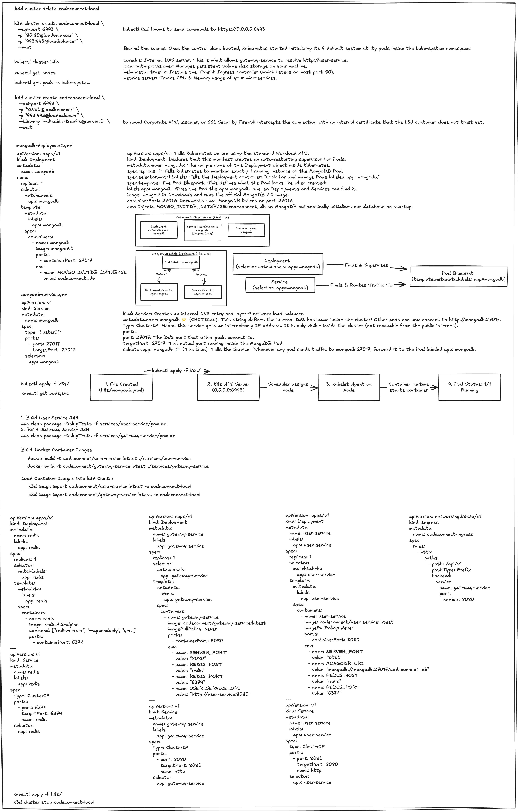
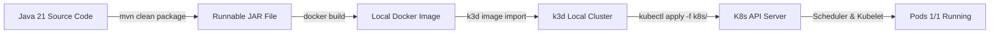
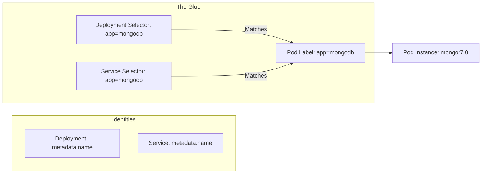
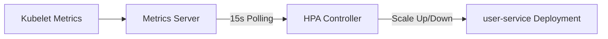
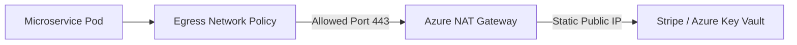

# CodeConnect — Microservices Kubernetes Deployment Architecture Guide

**Author:** Winston (System Architect)  
**Date:** September 2026  
**Stack:** Enterprise Java 21, Spring Boot 3.3, Docker, k3d (Local K8s), Azure AKS (Production Cloud Model)

---

## 1. Visual Deployment Architecture Cheatsheet

Below is the architectural diagram and handwritten deployment cheat sheet generated during cluster initialization:



---

## 2. End-to-End Build & Deployment Lifecycle

The deployment flow converts raw microservice code into fully orchestrated, self-healing pod instances inside Kubernetes:



### Step 1: Maven JAR Compilation
Build production JAR binaries for each microservice, bypassing test execution during image packaging:
```bash
mvn clean package -DskipTests -f services/user-service/pom.xml
mvn clean package -DskipTests -f services/gateway-service/pom.xml
```

### Step 2: Docker Image Build
Containerize microservices using standard Java 21 OCI runtime images:
```bash
docker build -t codeconnect/user-service:latest ./services/user-service
docker build -t codeconnect/gateway-service:latest ./services/gateway-service
```

### Step 3: Side-Loading Container Images into `k3d`
To bypass local corporate VPN/Zscaler SSL proxy inspection issues (`x509: certificate signed by unknown authority`), import images directly into the local `k3d` node container registry:
```bash
k3d image import codeconnect/user-service:latest -c codeconnect-local
k3d image import codeconnect/gateway-service:latest -c codeconnect-local
```

### Step 4: Manifest Application
Apply all declarative Kubernetes manifests at once:
```bash
kubectl apply -f k8s/
```

---

## 3. Cluster Management & Utility Services

### `k3d` Command Quick Reference
* **Create Cluster:**
  ```bash
  k3d cluster create codeconnect-local \
    --api-port 6443 \
    -p "80:80@loadbalancer" \
    -p "443:443@loadbalancer" \
    --k3s-arg "--disable=traefik@server:0" \
    --wait
  ```
* **Stop (Pause Cluster to save RAM/CPU):**
  ```bash
  k3d cluster stop codeconnect-local
  ```
* **Start (Resume Cluster):**
  ```bash
  k3d cluster start codeconnect-local
  ```
* **Delete (Clean Slate):**
  ```bash
  k3d cluster delete codeconnect-local
  ```

### Enterprise Cloud Reference (Azure AKS)
In production on Azure, the cluster management maps to Azure CLI:
```bash
# Pause AKS cluster to eliminate node compute charges
az aks stop --name codeconnect-aks --resource-group codeconnect-rg

# Resume AKS cluster
az aks start --name codeconnect-aks --resource-group codeconnect-rg
```

### System Utility Pods (`kube-system`)
Once control plane boots, Kubernetes initializes core utility components:
* **`coredns`**: Internal cluster DNS server enabling hostname resolution (e.g. `http://user-service:8080` or `mongodb:27017`).
* **`local-path-provisioner`**: Manages persistent volume disk storage on host machine.
* **`metrics-server`**: Tracks CPU and Memory consumption across pods for auto-scaling.

---

## 4. Kubernetes Core Abstractions

Understanding how Deployments, Pods, and Services interact:



1. **Deployment (`apps/v1`)**: The workload supervisor. Ensures exact replica counts (`replicas: 1`), performs rolling updates, and automatically restarts failed containers.
2. **Pod**: The smallest execution unit in Kubernetes wrapping one or more containers.
3. **Service (`v1`)**: The Layer-4 internal load balancer and static virtual IP. Service `metadata.name` creates an immutable internal DNS entry (e.g., `http://mongodb:27017`).

---

## 5. Complete Manifest Reference

All manifests reside under `k8s/`:

### A. Database Tier (`k8s/mongodb.yaml`)
```yaml
apiVersion: apps/v1
kind: Deployment
metadata:
  name: mongodb
  labels:
    app: mongodb
spec:
  replicas: 1
  selector:
    matchLabels:
      app: mongodb
  template:
    metadata:
      labels:
        app: mongodb
    spec:
      containers:
        - name: mongodb
          image: mongo:7.0
          ports:
            - containerPort: 27017
          env:
            - name: MONGO_INITDB_DATABASE
              value: codeconnect_db
---
apiVersion: v1
kind: Service
metadata:
  name: mongodb
  labels:
    app: mongodb
spec:
  type: ClusterIP
  ports:
    - port: 27017
      targetPort: 27017
      name: mongodb
  selector:
    app: mongodb
```

### B. Cache Tier (`k8s/redis.yaml`)
```yaml
apiVersion: apps/v1
kind: Deployment
metadata:
  name: redis
  labels:
    app: redis
spec:
  replicas: 1
  selector:
    matchLabels:
      app: redis
  template:
    metadata:
      labels:
        app: redis
    spec:
      containers:
        - name: redis
          image: redis:7.2-alpine
          command: ["redis-server", "--appendonly", "yes"]
          ports:
            - containerPort: 6379
---
apiVersion: v1
kind: Service
metadata:
  name: redis
  labels:
    app: redis
spec:
  type: ClusterIP
  ports:
    - port: 6379
      targetPort: 6379
      name: redis
  selector:
    app: redis
```

### C. Business Microservices Tier (`k8s/user-service.yaml`)
```yaml
apiVersion: apps/v1
kind: Deployment
metadata:
  name: user-service
  labels:
    app: user-service
spec:
  replicas: 1
  selector:
    matchLabels:
      app: user-service
  template:
    metadata:
      labels:
        app: user-service
    spec:
      containers:
        - name: user-service
          image: codeconnect/user-service:latest
          imagePullPolicy: Never
          ports:
            - containerPort: 8080
          env:
            - name: SERVER_PORT
              value: "8080"
            - name: MONGODB_URI
              value: "mongodb://mongodb:27017/codeconnect_db"
            - name: REDIS_HOST
              value: "redis"
            - name: REDIS_PORT
              value: "6379"
---
apiVersion: v1
kind: Service
metadata:
  name: user-service
  labels:
    app: user-service
spec:
  type: ClusterIP
  ports:
    - port: 8080
      targetPort: 8080
      name: http
  selector:
    app: user-service
```

### D. API Gateway Tier (`k8s/gateway-service.yaml`)
```yaml
apiVersion: apps/v1
kind: Deployment
metadata:
  name: gateway-service
  labels:
    app: gateway-service
spec:
  replicas: 1
  selector:
    matchLabels:
      app: gateway-service
  template:
    metadata:
      labels:
        app: gateway-service
    spec:
      containers:
        - name: gateway-service
          image: codeconnect/gateway-service:latest
          imagePullPolicy: Never
          ports:
            - containerPort: 8080
          env:
            - name: SERVER_PORT
              value: "8080"
            - name: REDIS_HOST
              value: "redis"
            - name: REDIS_PORT
              value: "6379"
            - name: USER_SERVICE_URI
              value: "http://user-service:8080"
---
apiVersion: v1
kind: Service
metadata:
  name: gateway-service
  labels:
    app: gateway-service
spec:
  type: ClusterIP
  ports:
    - port: 8080
      targetPort: 8080
      name: http
  selector:
    app: gateway-service
```

### E. Ingress Routing Tier (`k8s/ingress.yaml`)
```yaml
apiVersion: networking.k8s.io/v1
kind: Ingress
metadata:
  name: codeconnect-ingress
spec:
  rules:
    - http:
        paths:
          - path: /api/v1
            pathType: Prefix
            backend:
              service:
                name: gateway-service
                port:
                  number: 8080
```

---

## 6. Advanced Operational Concepts: HPA & Egress

### A. Horizontal Pod Autoscaler (HPA)
HPA automatically adjusts replica counts based on real-time metric thresholds.



**Calculation Formula:**
$$\text{Desired Replicas} = \left\lceil \text{Current Replicas} \times \left( \frac{\text{Current Metric Value}}{\text{Target Metric Value}} \right) \right\rceil$$

**Example HPA Spec (`k8s/user-service-hpa.yaml`):**
```yaml
apiVersion: autoscaling/v2
kind: HorizontalPodAutoscaler
metadata:
  name: user-service-hpa
spec:
  scaleTargetRef:
    apiVersion: apps/v1
    kind: Deployment
    name: user-service
  minReplicas: 2
  maxReplicas: 10
  metrics:
  - type: Resource
    resource:
      name: cpu
      target:
        type: Utilization
        averageUtilization: 70
```

### B. Egress Network Policy
Restricts outbound traffic leaving Kubernetes pods to protect against data exfiltration.



---

## 7. Troubleshooting & Diagnostic Playbook

| Issue Symptom | Root Cause | Solution |
| :--- | :--- | :--- |
| **500 Internal Server Error** (`IllegalArgumentException: Invalid email format`) | Request body contained `"email": "k8sstudent@codeconnect"` (missing TLD). | Append valid TLD, e.g., `"email": "k8sstudent@codeconnect.dev"`. |
| **404 Not Found** (`NoResourceFoundException`) after cluster stop | Host-level Spring Boot app running in IDE/terminal listening on port 8080 took over `localhost:8080`. | Run `lsof -i :8080` and terminate the host process using `kill -9 <PID>`. |
| **`x509: certificate signed by unknown authority`** | Local corporate proxy / Zscaler modifying HTTPS certificate chain during `docker pull`. | Side-load images using `k3d image import <image> -c codeconnect-local`. |
